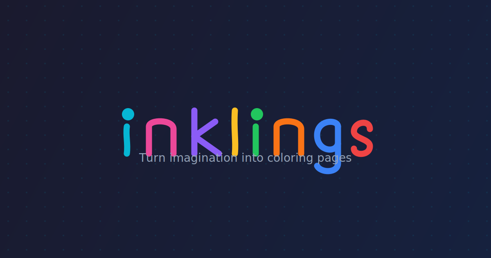

# ✨ Inklings

**Turn imagination into coloring pages**

AI-powered coloring page generator. Describe anything, get a printable line-art image ready to color!



## Features

- 🎨 **AI-Generated Line Art** - Creates clean black-and-white coloring pages
- 💡 **Fun Preset Ideas** - Kid-friendly suggestions to spark creativity
- 🖨️ **Print Ready** - One-click print with optimized formatting
- 📥 **Download** - Save images as PNG files
- 🔄 **Try Again** - Not quite right? Generate a new version instantly

## Tech Stack

- **Framework**: Next.js 14 (App Router)
- **Styling**: Tailwind CSS
- **Animation**: Framer Motion
- **AI**: Hugging Face Inference API (FLUX.1)
- **Language**: TypeScript

## Quick Start

### Prerequisites

- Node.js 18+
- pnpm (recommended) or npm
- Hugging Face account with API token

### Installation

```bash
# Install dependencies
pnpm install

# Copy environment template
cp .env.example .env.local

# Add your Hugging Face token to .env.local
# Get one at: https://huggingface.co/settings/tokens
```

### Development

```bash
pnpm dev
```

Open [http://localhost:3000](http://localhost:3000)

### Production Build

```bash
pnpm build
pnpm start
```

## Environment Variables

```bash
# Required - get yours at huggingface.co/settings/tokens
HF_TOKEN=hf_your_token_here

# Optional - use a different model
# HF_MODEL=black-forest-labs/FLUX.1-dev
```

## Deploy to Vercel

1. Push to GitHub
2. Import project in [Vercel](https://vercel.com)
3. Add environment variable: `HF_TOKEN`
4. Deploy!

[](https://vercel.com/new)

## Configuration

### Changing the AI Model

Edit `.env.local`:

```bash
# Faster generation (~10s)
HF_MODEL=black-forest-labs/FLUX.1-schnell

# Higher quality (~20s)
HF_MODEL=black-forest-labs/FLUX.1-dev
```

### Adding Custom Presets

Edit `src/lib/presets.ts` to add your own ideas.

**⚠️ Note**: Avoid trademarked characters in presets. Users can type whatever they want, but preset suggestions should be original ideas.

## API Rate Limits

The free Hugging Face tier has rate limits. For production:
- Consider a paid Hugging Face plan
- Implement request queuing
- Add user rate limiting

## License

MIT

---

Made with 💖 for creative kids everywhere
